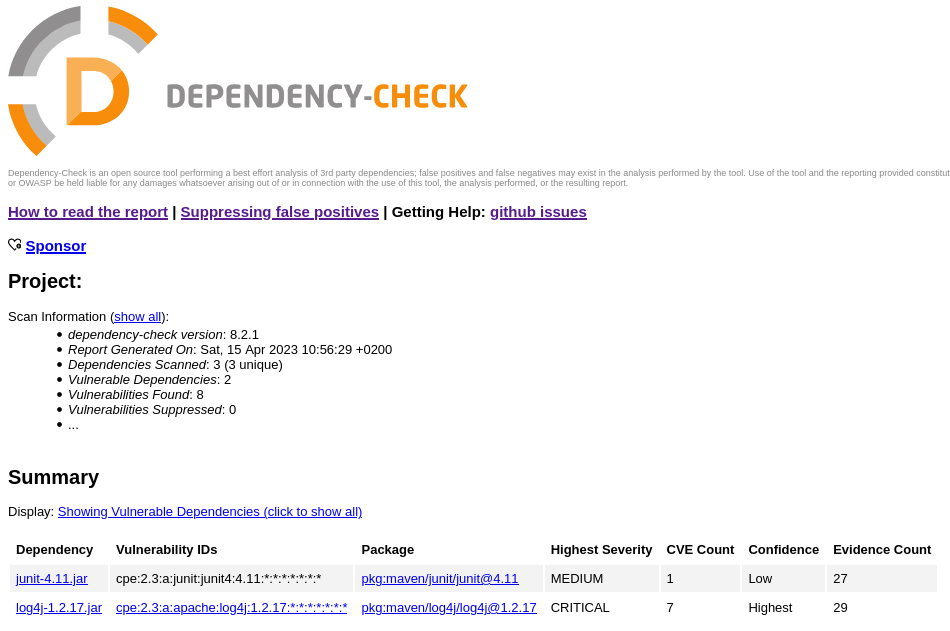

# OWASP Dependency Check

[OWASP's `dependency-check`](https://jeremylong.github.io/DependencyCheck/) scans software to identify the use of known vulnerable components. 
You can get `dependency-check` from its [GitHub repository](https://jeremylong.github.io/DependencyCheck/).

## Working principle
[`dependency-check` works](https://jeremylong.github.io/DependencyCheck/general/internals.html) by scanning files using so-called *analyzers*. The information collected during the scan is referred to as *evidence*. There are three types of evidence collected: 
* vendor
* product
* version.

As an example, the `JarAnalyzer` collects information from the Manifest `pom.xml` and the package names within the JAR files scanned.

Each CVE Entry in the NVD CVE database has a list of vulnerable software:
```xml
<entry id="CVE-2012-5055">

-- snip --

    <vuln:vulnerable-software-list>
        <vuln:product>cpe:/a:vmware:springsource_spring_security:3.1.2</vuln:product>
        <vuln:product>cpe:/a:vmware:springsource_spring_security:2.0.4</vuln:product>
        <vuln:product>cpe:/a:vmware:springsource_spring_security:3.0.1</vuln:product>
    </vuln:vulnerable-software-list>

-- snip --

</entry>
```

These [Common Platform Enumeration (CPE) entries](https://en.wikipedia.org/wiki/Common_Platform_Enumeration) are read "cpe:/[Entry Type]:[Vendor]:[Product]:[Version]:[Revision]:…". `dependency-check` downloads the CPE data, stores it in a Lucene Index, and compares the collected evidence to the Lucene CPE Index. If there is a match, the associated CVE entries are added to the report.

The evidence is rated using confidence levels "low", "medium", "high", and "highest". When the CPE is determined it is given a confidence level that is equal to the lowest level confidence level of evidence used during identification. As a result, because the CPE identification might be incorrect, `dependency-check` report can contain both false positives and false negatives.

Currently, `dependency-check` does not use file hashes for identification, the rationale being that if the dependency is built from source, the hash will likely not match the published hash. As a result, one would need a hash database for known vulnerabilities. The authors of `dependency-check` made a deliberate design decision to avoid maintaining such a database (however, [they state](https://jeremylong.github.io/DependencyCheck/general/thereport.html) that a future enhancement may add some hash matching for very common libraries like Spring or Struts).

## Installation
You can download the current `dependency-check` version and unpack it from https://github.com/jeremylong/DependencyCheck/releases. Simply unzip the file and you're good to go. Assuming you are on a Linux operating system, you run the tool by executing `dependency-check/bin/dependency-check.sh`.

## Vulnerable application example
If you don't have a Java Developer Kit installed on your system, you first need to e.g., (works for Ubuntu):

```bash
$ sudo apt install default-jdk -y
```

The example vulnerable Java application was created using Apache Maven:

```bash
$ mvn -B archetype:generate -DgroupId=com.vulncom.app -DartifactId=vuln-app -DarchetypeArtifactId=maven-archetype-quickstart -DarchetypeVersion=1.4
```

The above commands create a Java application where a Hello World class resides in `src/main/java/com/vulncom/app/App.java`:

```Java
package com.vulncom.app;

/**
 * Hello world!
 *
 */
public class App 
{
    public static void main( String[] args )
    {
        System.out.println( "Hello World!" );
    }
}
```

Based on [Apache's log4j 1.2 manual](https://logging.apache.org/log4j/1.2/manual.html), simple logging functionality was added:

```Java
package com.vulncom.app;

import org.apache.log4j.Logger;
import org.apache.log4j.LogManager;
import org.apache.log4j.BasicConfigurator;

/**
 * Hello world!
 *
 */
public class App 
{
    // create a static logger
    private static final Logger logger = LogManager.getLogger(App.class);

    public static void main( String[] args )
    {
        // Set up a simple configuration that logs on the console.
        BasicConfigurator.configure();

        System.out.println( "Hello World!" );

        // logging
        logger.debug("Some debug information");
    }
}
```

In addition, the vulnerable version of `log4j` was added to the application's `pom.xlm` file:

```xml
-- snip --
   <dependencies>

   -- snip ---

      <dependency>
         <groupId>log4j</groupId>
         <artifactId>log4j</artifactId>
         <version>1.2.17</version>
         <scope>compile</scope>
      </dependency>
   </dependencies>

-- snip --
```

To compile the vulnerable application:

```bash
$ cd vuln-app/
$ mvn compile
```

You can then run the default unit test or to run the vulnerable app itself:

```bash
$ mvn test
$ mvn exec:java
```

Before scanning the application with `dependency-check` you need to instruct Maven to download all dependencies your application is using:

```bash
$ mvn dependency:copy-dependencies
```

The above command will download all dependencies into `vuln-app/target/dependency`. This step is needed because &mdash; as [explained by Jeremy Long](https://github.com/jeremylong/DependencyCheck/issues/2470), the creator and maintainer of `dependency-check` &mdash; the tool does not just analyze a `pom.xml` outside of a Maven build. The reason for this is that `dependency-check` is not able to resolve the [transitive dependencies](https://stackoverflow.com/questions/41725810/what-is-a-transitive-maven-dependency). If it would analyze only `pom.xml`, it would only have limited evidence for CPE identification for the direct dependencies. In addition, `pom.xml` can be very complex with properties, profiles, dependency management section, parent `pom.xml` files, and so on; it is better to let Maven properly handle these complexities.

For more information on Maven, see [here](https://maven.apache.org/guides/getting-started/).
 

## Running `dependency-check`
You can now run `dependency-check` on the vulnerable application in the `vuln-app` directory (the option `-s` is the scan path):
```bash
$ dependency-check.sh -s vuln-app/
```

You might need to prefix `dependency-check.sh` with the path where you actually unpacked the [zipped release](https://github.com/jeremylong/DependencyCheck/releases) or add that path to your `$PATH` variable.

## Example terminal output
If your setup is correct, you should see something like this:
```bash
[INFO] Checking for updates
[INFO] NVD CVE requires several updates; this could take a couple of minutes.

-- snip --

[INFO] Download Started for NVD CVE - Modified
[INFO] Download Complete for NVD CVE - Modified  (8228 ms)
[INFO] Processing Started for NVD CVE - Modified
[INFO] Processing Complete for NVD CVE - Modified  (647 ms)
[INFO] Begin database maintenance
[INFO] Updated the CPE ecosystem on 132640 NVD records
[INFO] Removed the CPE ecosystem on 3718 NVD records
[INFO] End database maintenance (10842 ms)
[INFO] Updating CISA Known Exploited Vulnerability list: https://www.cisa.gov/sites/default/files/feeds/known_exploited_vulnerabilities.json
[INFO] Begin database defrag
[INFO] End database defrag (3212 ms)
[INFO] Check for updates complete (380085 ms)
[INFO] 

Dependency-Check is an open source tool performing a best effort analysis of 3rd party dependencies; false positives and false negatives may exist in the analysis performed by the tool. Use of the tool and the reporting provided constitutes acceptance for use in an AS IS condition, and there are NO warranties, implied or otherwise, with regard to the analysis or its use. Any use of the tool and the reporting provided is at the user’s risk. In no event shall the copyright holder or OWASP be held liable for any damages whatsoever arising out of or in connection with the use of this tool, the analysis performed, or the resulting report.


   About ODC: https://jeremylong.github.io/DependencyCheck/general/internals.html
   False Positives: https://jeremylong.github.io/DependencyCheck/general/suppression.html

💖 Sponsor: https://github.com/sponsors/jeremylong


[INFO] Analysis Started
[INFO] Finished Archive Analyzer (0 seconds)
[INFO] Finished File Name Analyzer (0 seconds)
[INFO] Finished Jar Analyzer (0 seconds)
[INFO] Finished Central Analyzer (0 seconds)
[INFO] Finished Dependency Merging Analyzer (0 seconds)
[INFO] Finished Version Filter Analyzer (0 seconds)
[INFO] Finished Hint Analyzer (0 seconds)
[INFO] Created CPE Index (1 seconds)
[INFO] Finished CPE Analyzer (2 seconds)
[INFO] Finished False Positive Analyzer (0 seconds)
[INFO] Finished NVD CVE Analyzer (0 seconds)
[INFO] Finished Sonatype OSS Index Analyzer (1 seconds)
[INFO] Finished Vulnerability Suppression Analyzer (0 seconds)
[INFO] Finished Known Exploited Vulnerability Analyzer (0 seconds)
[INFO] Finished Dependency Bundling Analyzer (0 seconds)
[INFO] Finished Unused Suppression Rule Analyzer (0 seconds)
[INFO] Analysis Complete (4 seconds)
[INFO] Writing report to: /home/paul/Repositories/devsecops_by_example/OWASP_dependency_check/./dependency-check-report.html
```

## Example HTML report
Now, if you open the HTML report, you should see something like this:


